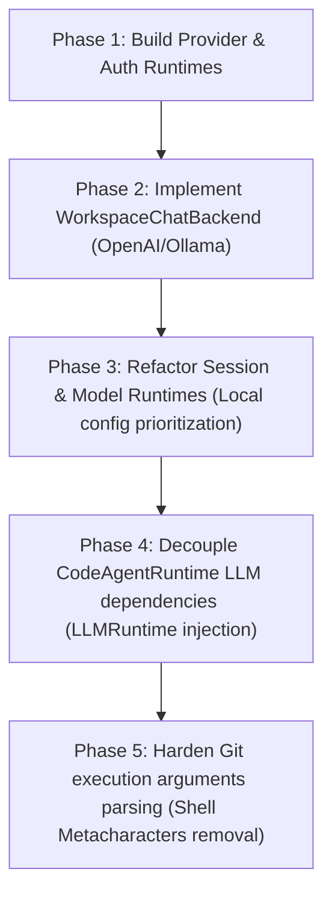

# Hermes Agent Code Import Strategy

This document outlines the architectural plan to import, adapt, and vendor core subsystems from the Hermes Agent codebase directly into the Unified AI Workspace Engine. By doing so, we establish a standalone server capable of managing providers, models, authentication credentials, and chat backends without external dependencies.

---

## 1. Core Principles

1. **Standalone Operation**: AI Workspace must function independently of the Hermes Desktop App and the legacy `hermes serve` wrapper.
2. **First-Class Workspace Ownership**: Configuration metadata and session storage reside strictly within the workspace's `.ai-workspace/` state store.
3. **Graceful Compatibility Layer**: Legacy `/api/hermes/*` routes and `HERMES_SERVER_URL` hooks are retained purely as optional fallback bridges.

---

## 2. Code Assessment & Module Mapping

The following table divides the Hermes Agent codebase into modules to import and modules to exclude:

| Component | Target Location in Workspace | Import / Re-use Strategy | Action Status |
| :--- | :--- | :--- | :--- |
| **Model Registry** | `server/lib/model-runtime.mjs` | Extracted and integrated with `.ai-workspace/config.json`. | **Ready for Integration** |
| **Provider Registry** | `server/lib/provider-runtime.mjs` | Custom CRUD handlers reading/writing to the state store configuration. | **NEW Runtime** |
| **Credentials & Auth** | `server/lib/auth-runtime.mjs` | API key masking, local keychain-ready storage, and credential selection helper. | **NEW Runtime** |
| **OpenAI-Compatible Driver**| `server/lib/workspace-chat-backend.mjs`| Native implementation targeting `/v1/chat/completions` API schema. | **NEW Backend** |
| **Ollama / Local Driver** | `server/lib/workspace-chat-backend.mjs`| Direct mapping to OpenAI-compatible drivers using custom base URLs. | **NEW Backend** |
| **Session State Store** | `server/lib/session-runtime.mjs` | Local `.json` files representing serialized chat contexts. | **Active & Extended** |
| **LLM Runtime Bridge** | `server/lib/llm-runtime.mjs` | Isolated interface managing code patch generation and prompt formatting. | **NEW Runtime** |

### Modules to Exclude
- **Hermes Dashboard UI & Cookies**: The Unified Engine does not serve or use session cookies for dashboard access control.
- **Process Spawning / CLI Wrappers**: The engine executes directly inside the Node process space, removing shell wraps.

---

## 3. License & Attribution

- **License**: The imported logic inherits the MIT/Apache licenses (subject to Hermes Agent's repository details).
- **Attribution**: Original authors are acknowledged in `third_party/LICENSE` or inline module file headers where applicable.

---

## 4. Phase-by-Phase Integration Roadmap

